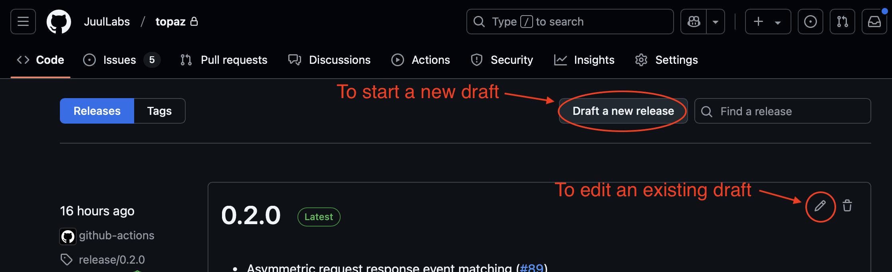
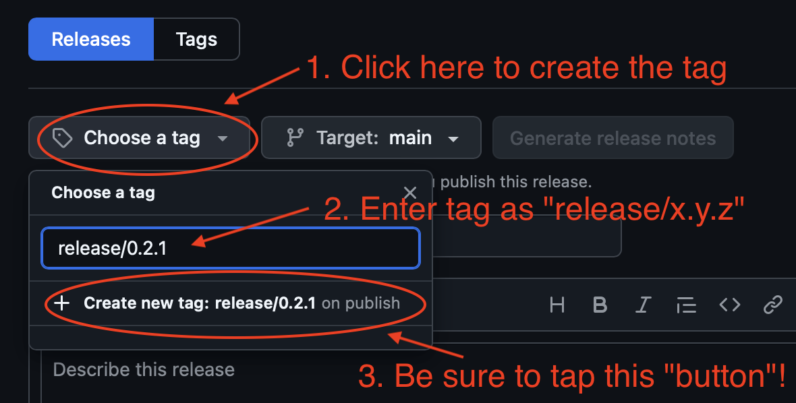
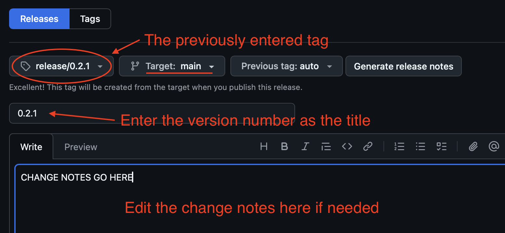

## Publishing To App Store

### Via GitHub UI

To publish a build to App Store Connect using the GitHub UI, go to the [releases page]. From there you may create a new release draft, or edit an existing one.

#### Step 1

Typically there will be a release draft already in progress as one is automatically created when changes are merged to `main` branch. So normally you would start by editing a pre-existing draft release:


#### Step 2

The publish action requires a specific git tag format of `release/x.y.z`. The app will then appear in App Store Connect as version `x.y.z`. On the edit screen enter the tag as `release/x.y.z` and be sure to click the "Create new tag on publish" button:


> [!IMPORTANT]
> When entering the tag it is _critical_ to click the **"Create new tag on publish"** button. It is the tag itself that triggers the publishing process and it is easy to miss this "button" in the GitHub UI.

#### Step 3

Once the tag is entered, proceed with giving the release a title. For this we normally want to use just the version number e.g. `x.y.z`. The changes notes should already contain the full change log popultaed by the auto-release-drafter but feel free to edit as needed:


After that, you can save it and come back to it later, or when done hit the big green "Publish" button. This will trigger a GitHub Action to perform the build and upload the artifacts to App Store Connect. You can view the status of the action on the [actions page].

### Via Command Line

To trigger the `publish.yml` GitHub Action from the command line, push a tag of the form `release/x.y.z` e.g.:

```sh
$ git tag -a release/1.2.3 -m "Verison 1.2.3 App Store Release"
$ git push origin release/1.2.3
```

[releases page]: releases
[actions page]: actions
